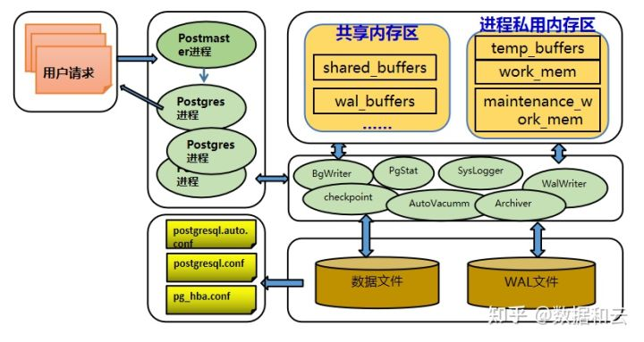

# 概念

## 整体架构图

## 主要进程

Postmaster进程
PG数据库的总控制进程，负责启动和关闭数据库实例，是一个指向postgres命令的链接，算是第一个postgres进程。
Postmaster的主进程，还会fork出一些辅助子进程。  

BgWriter（后台写）进程
WaLWriter（预写式日志）进程
AutoVAcuum（系统自动清理）
SysLogger（系统日志）进程
PgArch（归档）进程    
PgStat（统计数据收集）进程    
CheckPoint（检查点）进程

## 内存

### 共享内存区

shared_buffers ---共享缓冲区
它表示数据缓冲区中的数据块的个数，每个数据块的大小是8KB。
数据缓冲区位于数据库的共享内存中，它越大越好，不能小于128KB。
这个参数只有在启动数据库时，才能被设置。
默认值是128MB。
推荐值：1/4 主机物理内存  

wal_buffers --- 日志缓存区的大小
可以降低IO，如果遇上比较多的并发短事务，应该和commit_delay一起用
存放WAL数据的内存空间大小，系统默认值是64K

### 私有内存区

temp_buffers---临时缓冲区
用于存放数据库会话访问临时表数据，系统默认值为8M。
可以在单独的session中对该参数进行设置，尤其是需要访问比较大的临时表时，将会有显著的性能提升。
work_mem --- 工作内存或者操作内存。
其负责内部的sort和hash操作，合适的work_mem大小能够保证这些操作在内存中进行。
maintenance_work_mem ---维护工作内存
主要是针对数据库的维护操作或者语句。
主要针对VACUUM，CREATE INDEX，ALTER TABLE ADD FOREIGN KEY等操作。
在对整个数据库进行VACUUM或者较大的index进行重建时，适当的调整该参数非常必要
postresql文档提示在启用了autoacuum功能的情况下，该参数不能配置的过大

## 逻辑结构

## page 页面结构

更多细节：https://blog.csdn.net/sjhsxjsdb/article/details/128403891

- Page Header
Page的基本信息，描述整个 page 的情况，比如空闲空间，校检值等
指向空闲空间(free space)
长为 24 bytes
typedef struct PageHeaderData

- item
ItemIdData（Row/Index Pointers）
一个记录偏移量/长度(offset/length)的数组，
指向实际的记录(rows/index entries)
每一个 item 4字节

- Free Space
未分配的空间
新指针(pointers )从这个区域的开头开始分配
新的记录(rows/index entries)从结尾开始分配 

- Tuple
Items（Row/Index Entry）
实际的记录本身，用来存储实际数据

- Special
不同的索引访问方式相关的数据，用来存储一些特殊数据
在普通表中为空

## buffer_tag

包括三个值：

- RelFileNode(由表所在的表空间OID，数据库OID和表本身的OID构成)
- forkNum（标记缓冲区中是什么类型的文件快）
    表是0
    freespace maps是1
    visibility maps是2
    块号
    例如：buffer_tag '{(16821, 16384, 37721), 0, 7}'
    (16821, 16384, 37721)是RelFileNode，其中表空间OID是16821，数据库OID是16384，表的OID是37721
- 0是forkNum
    7是块号

## 物理结构-数据存储方式

### 目录结构

默认表空间的数据文件存放在base目录
在pg_xlog保存WAL日志，只能通过软链改变它的位置
段(Segments)
每一个表和索引都存放到单独的数据文件中
文件名是表或索引的文件结点(filenode)编号
如果表或索引超过 1 GB 就会被分割为多个段
第一个段以文件结点(filenode)编号命名，第二个以及之后的段以filenode.1, filenode.2形式命名
Page(Block)和Buffer
在磁盘中称为page,内存中称为buffer
默认为8k,可以在编译时指定block_size参数改变大小
Relation：表示表或索引
Tuple（row）表中的行

### 空闲空间映射(FSM)

每一个表和索引（除了哈希索引）都有一个空闲空间映射（FSM）来保持对关系中可用空间的跟踪
伴随主关系数据被存储在一个独立的关系分支中，以关系的文件节点号加上一个_fsm后缀命名
FSM文件是执行VACUUM操作时，或者是为了插入行而第一次查询FSM文件时才会创建
PostgreSQL使用了树形结构组织FSM文件
FSM可以在数据插入时快速找到满足大小要求的空闲空间，从而复用空闲空间

### 可见性映射(VM)

为了能加快VACUUM清理的速度和降低对系统I/O性能的影响，V8.4版本以后为每个数据文件加了一个后缀为“__vm “的文件
每一个表都有一个可见性映射（VM）用来跟踪哪些页面只包含已知对所有活动事务可见的元组，它也跟踪哪些页面只包含未被冻结的元组。
它随着主关系数据被存储在一个独立的关系分支中，以该关系的文件节点号加上一个_vm后缀命名
有了这个文件后，通过VACUUM命令扫描这个 文件时，如果发现VM文件中这个数据块上的位表示该数据块没有需要清理的行，则会跳过对这个数据块的扫描，从而加快VACUUM清理的速度。
pg_visibility模块可以被用来检查存储在可见性映射中的信息